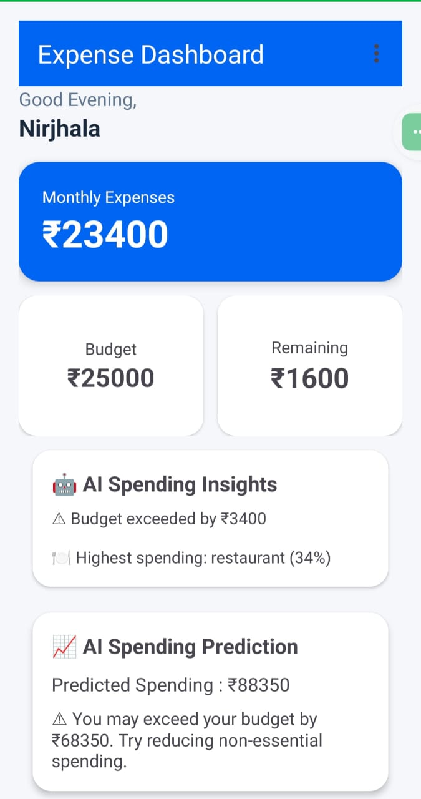
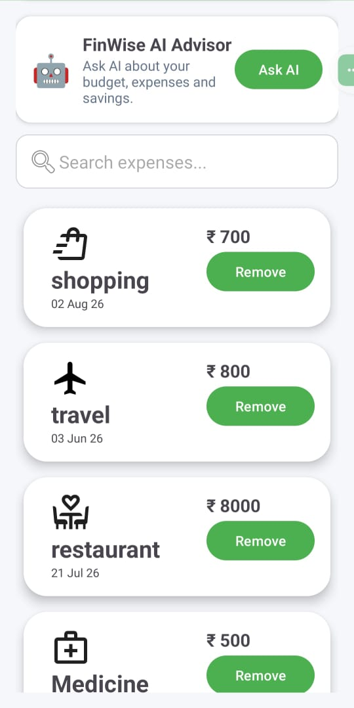
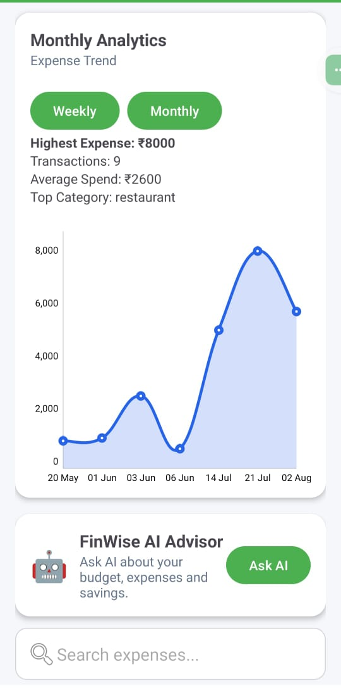
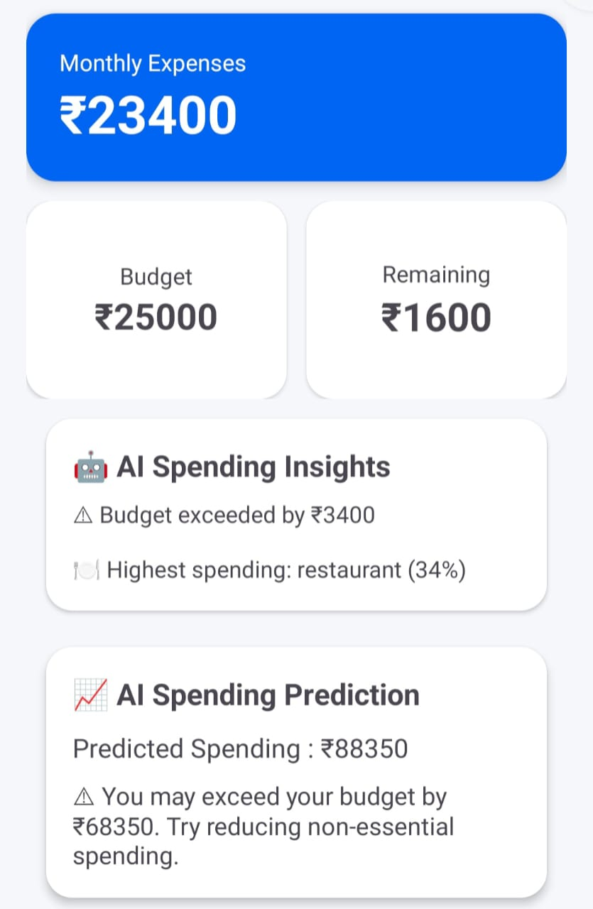
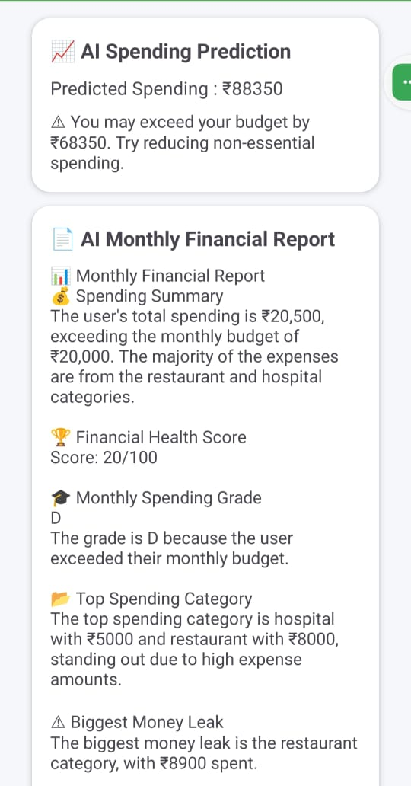
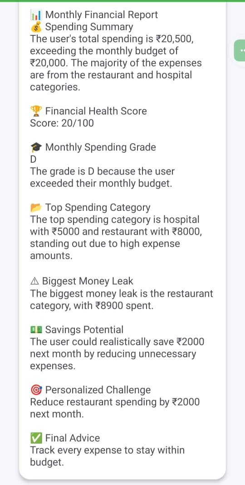
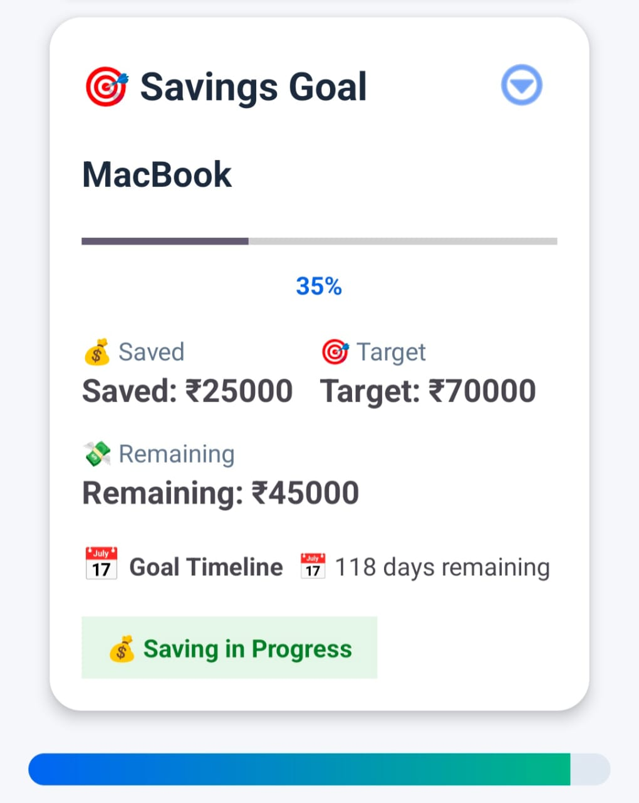
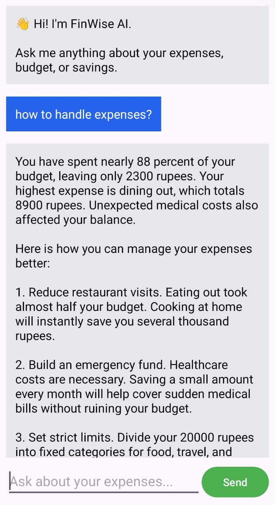
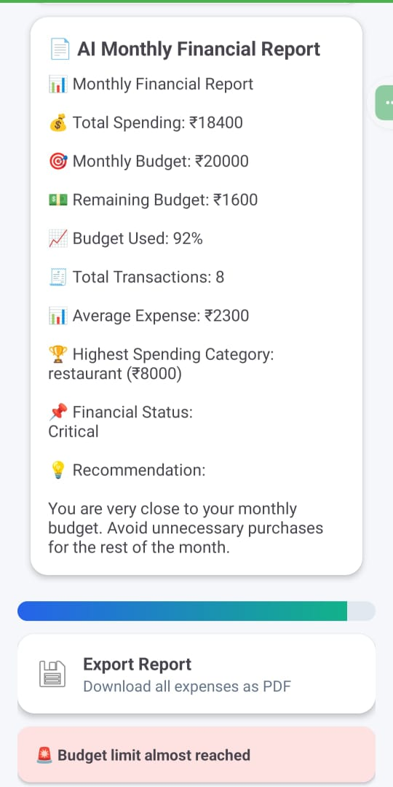

# 🤖 AI-Powered Smart Expense Tracker

<p align="center">


</p>
<p align="center">
An <strong>AI-Powered Personal Finance Management Android Application</strong> built with <strong>Kotlin</strong>, <strong>Firebase</strong>, <strong>Cloud Firestore</strong>, <strong>Groq LLM</strong>, and <strong>Google Gemini</strong> that combines intelligent financial analytics, budgeting, predictive insights, and AI-assisted money management.
</p>
<p align="center">
Built as a production-style Android application demonstrating AI integration, Firebase backend development, modern Android architecture, and intelligent financial analytics.
</p>

<p align="center">
⭐ If you found this project helpful, please consider giving it a star!
</p>


---

# 📌 Overview

AI-Powered Smart Expense Tracker is a modern Android finance management application built using **Kotlin**, **Firebase**, **Cloud Firestore**, and **Large Language Models (Groq & Google Gemini)**.

Unlike a traditional expense tracker, this application combines intelligent financial analytics, AI-powered insights, predictive spending analysis, savings goal management, and interactive dashboards to help users better understand and improve their spending habits.

The project demonstrates modern Android development practices including Firebase Authentication, Cloud Firestore integration, REST API communication, AI model integration, local storage, PDF generation, and data visualization.

---

# ✨ Key Highlights

- 🤖 AI Powered Expense Insights
- 📈 Spending Prediction Engine
- 📄 AI Monthly Financial Report
- 💬 AI Financial Chat Assistant
- 🎯 Savings Goal Tracker
- 📊 Interactive Analytics Dashboard
- 💰 Budget Management System
- ☁ Firebase Authentication
- 🔥 Cloud Firestore Database
- 📑 PDF Expense Report Export
- 📱 Modern Material UI

---

# 🚀 Features

## 💸 Expense Management

✔ Add Expenses

✔ Delete Expenses

✔ Real-Time Firestore Sync

✔ Search Expenses

✔ Weekly Expense Filter

✔ Monthly Expense Filter

✔ Category Based Expense Tracking

✔ Automatic Total Expense Calculation

---

## 🤖 AI Features

✔ AI Expense Insights

✔ AI Spending Pattern Analysis

✔ AI Spending Prediction

✔ AI Monthly Financial Report Generator

✔ AI Financial Assistant Chat

✔ Groq LLM Integration

✔ Google Gemini Integration

✔ Intelligent Financial Recommendations

---

## 🎯 Savings Goal Tracker

✔ Create Savings Goals

✔ Goal Timeline

✔ Savings Progress Indicator

✔ Remaining Savings Calculation

✔ Goal Completion Status

✔ Edit Goal

✔ Delete Goal

✔ Firestore Synchronization

---

## 💰 Budget Management

✔ Editable Monthly Budget

✔ Remaining Budget

✔ Budget Progress Bar

✔ Budget Usage Percentage

✔ Budget Warning Alerts

---

## 📊 Analytics Dashboard

✔ Category-wise Pie Chart

✔ Expense Trend Line Chart

✔ Highest Spending Category

✔ Total Transactions

✔ Average Expense

✔ Monthly Spending Summary

✔ Top Spending Category

---

## 📄 Reports

✔ PDF Expense Report

✔ AI Generated Monthly Report

✔ Financial Summary

---

## 🔐 Authentication

✔ Firebase Email Authentication

✔ Secure User Login

✔ User Registration

✔ Session Management

---

# 📱 Application Screenshots

> **Latest screenshots will be added after the final release build.**

| Login | Dashboard |
|-------|-----------|
|  |  |

| Add Expense | Expense List |
|-------------|--------------|
|  |  |

| Search | Analytics |
|--------|-----------|
|  |  |

| Pie Chart | Line Chart |
|-----------|------------|
|  |  |

| AI Insights | AI Prediction |
|-------------|---------------|
|  |  |

| Monthly AI Report | Savings Goal |
|-------------------|--------------|
|  |  |

| AI Chat | PDF Export |
|---------|------------|
|  |  |

---

# 🏗 System Architecture

```
                        ┌──────────────────────────┐
                        │      Android App         │
                        │ (Kotlin + XML UI Layer)  │
                        └────────────┬─────────────┘
                                     │
                    ┌────────────────┴────────────────┐
                    │                                 │
             Firebase Services                 AI Services
                    │                                 │
      ┌─────────────┴─────────────┐          ┌────────┴────────┐
      │                           │          │                 │
 Firebase Authentication   Cloud Firestore   Groq LLM    Google Gemini
      │                           │          │                 │
      └─────────────┬─────────────┘          └────────┬────────┘
                    │                                 │
             Expense Management          AI Insights • Prediction
             Budget Tracking             Monthly Reports • AI Chat
             Savings Goals
```

---

# ⚙ Technology Stack

| Category | Technologies |
|-----------|--------------|
| **Language** | Kotlin |
| **UI** | XML, Material Design |
| **IDE** | Android Studio |
| **Authentication** | Firebase Authentication |
| **Database** | Cloud Firestore |
| **AI Models** | Groq LLM, Google Gemini |
| **Networking** | Retrofit, OkHttp |
| **Charts** | MPAndroidChart |
| **Storage** | SharedPreferences |
| **Architecture** | Activity-Based Android Architecture |
| **Version Control** | Git & GitHub |

---

# 🤖 AI Capabilities

The application integrates modern Large Language Models (LLMs) to provide intelligent financial assistance beyond traditional expense tracking.

### 💡 AI Expense Insights

- Detects spending patterns
- Identifies unusual expenses
- Highlights financial trends
- Generates personalized recommendations

---

### 📈 Spending Prediction

The application analyzes historical transactions and estimates future spending trends to help users plan their finances proactively.

---

### 📄 AI Monthly Financial Report

Automatically generates an AI-powered financial summary including:

- Spending overview
- Highest expense categories
- Savings suggestions
- Financial observations
- Personalized recommendations

---

### 💬 AI Financial Assistant

An integrated chatbot allows users to ask finance-related questions, understand their spending behaviour, and receive AI-assisted responses.

---

# 🔥 Firebase Integration

Firebase powers the application's backend services.

### Authentication

- Secure Login
- Secure Registration
- Persistent User Sessions

### Cloud Firestore

Stores:

- Expenses
- Savings Goals
- User-specific Financial Data

Provides:

- Real-time synchronization
- Cloud-based storage
- Secure document database

---

# 📂 Project Structure

```
ExpenseTracker
│
├── activities
│      ├── MainActivity
│      ├── DashboardActivity
│      ├── AddExpenseActivity
│      └── ChatActivity
│
├── adapter
│      └── ExpenseAdapter
│
├── model
│      ├── Expense
│      └── SavingsGoal
│
├── network
│      ├── GroqService
│      ├── GeminiService
│      └── RetrofitClient
│
├── utils
│      ├── PDF Generator
│      ├── Analytics Engine
│      └── Budget Calculator
│
├── res
│      ├── layouts
│      ├── drawables
│      ├── menu
│      └── values
│
└── Firebase
```

---

# 🔄 Application Workflow

```
User Login
      │
      ▼
Firebase Authentication
      │
      ▼
Dashboard
      │
      ▼
Expense Management
      │
      ▼
Firestore Database
      │
      ▼
Analytics Engine
      │
      ▼
AI Engine
      │
      ├── AI Insights
      ├── Spending Prediction
      ├── Monthly Report
      └── AI Chat
      │
      ▼
Interactive Dashboard
```

---

# 📊 Data Visualization

The application provides interactive financial analytics through graphical representations.

### Pie Chart

- Category-wise spending distribution
- Expense breakdown
- Financial visualization

### Line Chart

- Spending trend analysis
- Monthly comparison
- Historical expense visualization

---

# 📦 Dependencies

Major libraries used in this project:

- Firebase Authentication
- Cloud Firestore
- Retrofit
- OkHttp
- MPAndroidChart
- RecyclerView
- CardView
- Material Components
- Kotlin Coroutines

---

# 🚀 Installation

### 1️⃣ Clone Repository

```bash
git clone https://github.com/mohapatranirjhala-stack/ExpenseTracker-Android.git
```

---

### 2️⃣ Open in Android Studio

Open the project using the latest stable version of Android Studio.

---

### 3️⃣ Configure Firebase

Download your own

```
google-services.json
```

Place it inside

```
app/
```

---

### 4️⃣ Configure API Keys

Create or update your local **gradle.properties**

```
GROQ_API_KEY=YOUR_GROQ_API_KEY
GEMINI_API_KEY=YOUR_GEMINI_API_KEY
```

> **Note:** API keys are intentionally excluded from the repository for security reasons.

---

### 5️⃣ Sync Gradle

Allow Android Studio to download all required dependencies.

---

### 6️⃣ Run Application

Run on:

- Android Emulator
- Physical Android Device

Minimum SDK:

```
Android 7.0 (API 24)
```

Recommended:

```
Android 13+
```
---

# 💡 Key Learnings

This project provided hands-on experience in designing and developing a production-style Android application with modern technologies and AI integration.

Throughout the development process, I gained practical experience in:

- Native Android Development using Kotlin
- Firebase Authentication & Cloud Firestore
- REST API Integration using Retrofit
- AI Integration with Groq & Google Gemini
- Financial Data Visualization using MPAndroidChart
- Android UI Design with Material Components
- RecyclerView Implementation
- Local Data Management using SharedPreferences
- PDF Report Generation
- Real-Time Cloud Database Synchronization
- AI Prompt Engineering
- Android Debugging & Performance Optimization
- Git & GitHub Version Control

---

# 🛠 Skills Demonstrated

### Mobile Development

- Kotlin
- XML Layouts
- Android Studio
- Material Design

### Backend Integration

- Firebase Authentication
- Cloud Firestore
- REST APIs
- JSON Parsing

### AI & Intelligent Features

- Large Language Model (LLM) Integration
- Groq API
- Google Gemini API
- AI-Based Financial Insights
- AI Chat Assistant
- Spending Prediction

### Data Visualization

- MPAndroidChart
- Pie Charts
- Line Charts
- Financial Analytics Dashboard

### Software Engineering

- Object-Oriented Programming
- Modular Code Organization
- UI/UX Design
- Version Control using Git
- Problem Solving
- Debugging

---

# 🔒 Security

To protect sensitive credentials and follow best practices:

- API keys are **not included** in the repository.
- Firebase configuration should be supplied by adding your own `google-services.json`.
- AI API keys should be stored locally using `gradle.properties`.
- Secret keys should never be committed to Git.

---

# 📈 Future Enhancements

The following features are planned for future releases:

- ✏ Expense Editing
- 🧾 OCR Receipt Scanner
- 🎤 Voice-Based Expense Entry
- 💱 Multi-Currency Support
- ☁ Cloud Backup & Restore
- 📅 Calendar View of Expenses
- 🔔 Smart Bill Reminders
- 📊 Advanced Spending Forecasting
- 🤖 AI Budget Planning Assistant
- 🌍 Multi-Language Support
- 📱 Home Screen Widgets
- 📤 CSV & Excel Export

---

# 📌 Why This Project?

Traditional expense trackers only record transactions.

This project goes beyond expense logging by integrating AI-powered financial intelligence that helps users:

- Understand spending habits
- Predict future expenses
- Receive personalized financial insights
- Track savings goals
- Generate monthly financial reports
- Interact with an AI financial assistant

The objective was to combine Android development, cloud technologies, and modern AI capabilities into a practical personal finance application.

---

# 🤝 Contributing

Contributions, ideas, and feature suggestions are welcome.

If you'd like to improve this project:

1. Fork the repository
2. Create a new feature branch
3. Commit your changes
4. Push the branch
5. Open a Pull Request

---

# ⭐ Project Status

✅ Actively Maintained

New features and improvements will continue to be added over time.

---

# 📜 License

This project is released under the MIT License.

You are free to use, modify, and learn from this project while retaining proper attribution.

---

# 👨‍💻 Author

## Nirjhala Mohapatra

Final Year B.Tech Computer Science Engineering Student

Interested in:

- Android Development
- Artificial Intelligence
- Cloud Computing
- Full Stack Development

### Connect with Me

- GitHub: https://github.com/mohapatranirjhala-stack
- LinkedIn: *(Add your LinkedIn profile here)*
- LeetCode: *(Add your LeetCode profile here)*

---

<p align="center">

⭐ If you found this project useful, consider starring the repository.

Made with ❤️ using Kotlin, Firebase & AI.

</p>
