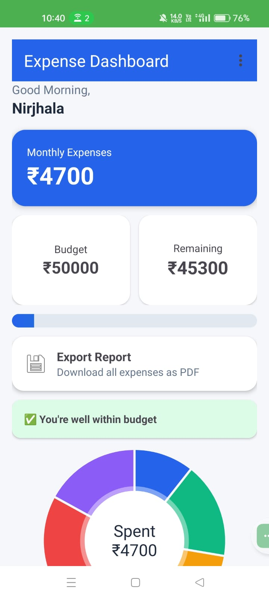
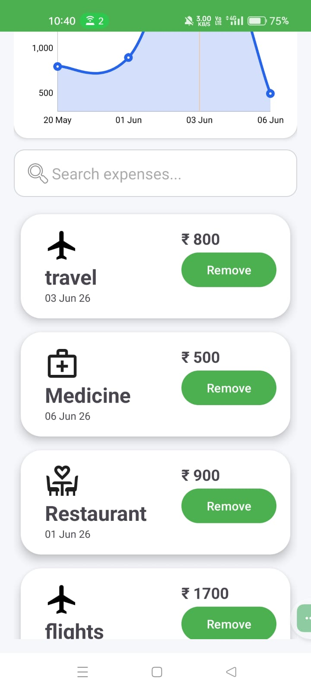
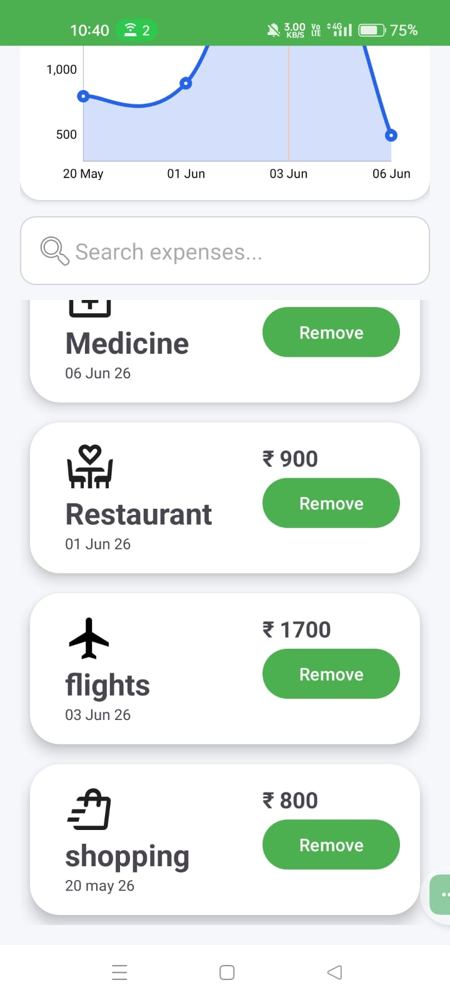
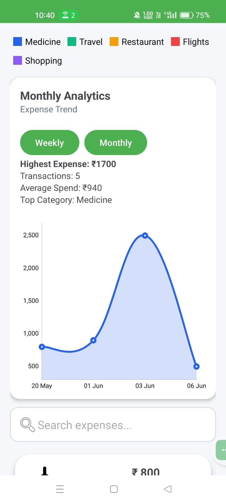
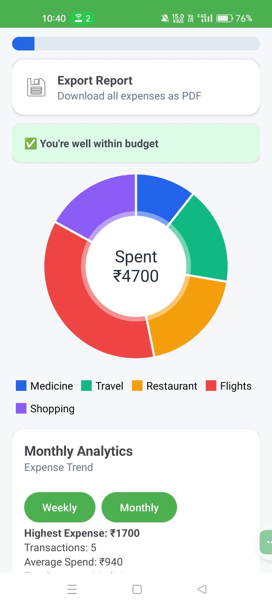

Expense Tracker Android App

A modern Android finance management application built using Kotlin and Firebase that helps users track expenses, manage budgets, and analyze spending behavior through interactive visualizations.

Features

Expense Management

- Add expenses
- Delete expenses
- Search expenses
- Real-time updates from Firebase Firestore

Budget Management

- Editable monthly budget
- Remaining budget calculation
- Budget usage progress indicator
- Budget alert system

Analytics

- Category-wise Pie Chart
- Spending Trend Line Chart
- Monthly Analytics Dashboard
- Weekly Filter
- Monthly Filter

Reports

- PDF Expense Report Export

User Experience

- Category Icons
- Modern Dashboard UI
- Responsive Design
- Firebase Authentication

Tech Stack

Frontend

- Kotlin
- XML Layouts
- Android Studio

Backend

- Firebase Authentication
- Cloud Firestore

Libraries

- MPAndroidChart
- RecyclerView
- CardView

Local Storage

- SharedPreferences

Application Flow

User Login/Register
↓
Firebase Authentication
↓
Dashboard
↓
Add / Search / Delete Expenses
↓
Firestore Database
↓
Analytics Engine
↓
Pie Chart + Line Chart + Budget Tracking

## 📸 Application Screenshots

### 🏠 Dashboard

### 💸 Expense Management

### 🔍 Expense Search

### 📈 Monthly Analytics

### 📉 Expense Trend Analysis

### 🥧 Category Distribution

Skills Demonstrated

- Android Development
- Kotlin Programming
- Firebase Authentication
- Cloud Firestore Integration
- Data Visualization
- Mobile UI/UX Design
- State Management
- RecyclerView Implementation
- SharedPreferences
- PDF Generation
- Analytics Dashboard Development

Learning Outcomes

Through this project I gained practical experience in:

- Building complete Android applications from scratch
- Integrating Firebase services
- Designing finance-oriented user interfaces
- Implementing data analytics and visualizations
- Managing cloud-based user data
- Developing production-style mobile applications

Installation

1. Clone the repository

git clone https://github.com/YOUR_USERNAME/Expense-Tracker-Android.git

2. Open project in Android Studio

3. Add your own Firebase configuration file

google-services.json

4. Sync Gradle

5. Run on emulator or physical device

